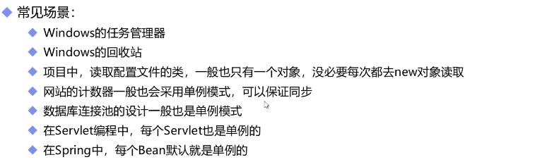
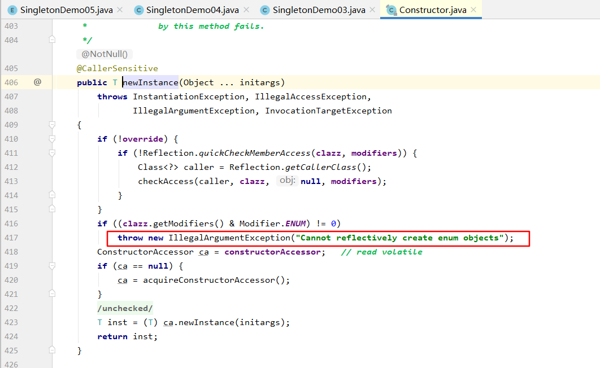

### 核心作用

* #### 保证1个类只有一个实例(只有一个new的对象)，并且提供一个访问该实例的全局访问点。

* #### 优点

  * 只生成1个实例，减少系统性能开销。
  * 单例模式可以在系统设置全局的访问点，优化共享资源访问。

### 常见场景

* 任务管理器、回收站-只能弹出一个窗口



### 实现方式

* 饿汉式：线程安全，调用效率高，不能延时加载
* 懒汉式：线程安全，调用效率不高，延时加载
* DCL懒汉式：由于JVM底层内部模型原因，偶尔会出现问题，不建议使用
* 饿汉式改进：静态内部类式，线程安全调用效率高，可以延时加载
* 枚举单例：线程安全，调用效率高，不能延时加载

#### 1.饿汉式

* 缺点是如果定义了开辟空间的属性，类加载的时候也会一起加载，如果不使用就浪费了，因此出现了懒汉式

```java
package com.rzp.singlet;


//饿汉式单例
public class SingletonDemo01 {
    //1.构造器私有化，保证其他不能New对象
    private SingletonDemo01() {
    }
    //2.类初始化的时候，立刻加载该对象，和1加起来，保证只有1个实例
    private static SingletonDemo01 instance = new SingletonDemo01();

    //3.提供获取该对象的方法，没有synchronized，效率高
    public static SingletonDemo01 getInstance(){
        return instance;
    }

    //缺点:如果定义了开辟空间的属性，类加载的时候也会一起加载，如果不使用就浪费了
    private byte[] data1 = new byte[100];
}

class SingletDemo01Test{
    public static void main(String[] args) {
        SingletonDemo01 instance = SingletonDemo01.getInstance();

    }
}
```

#### 2.懒汉式

* 获取对象的方法加入了synchronized，效率低，因此出现了DCL懒汉式

```java
package com.rzp.singlet;

//懒汉式
public class SingletonDemo02 {
    //1.构造器私有化，保证其他不能New对象
    private SingletonDemo02() {
    }
    //2.类初始化的时候，不立刻加载该对象，修改了饿汉式的缺点
    private static SingletonDemo02 instance ;

    //3.提供获取该对象的方法，有synchronized，效率低
    //为了弥补效率低，出现了DCL懒汉式
    public static synchronized SingletonDemo02 getInstance(){
        if (instance==null){
            instance = new SingletonDemo02();
        }
        return instance;
    }
}

class SingletDemo02Test{
    public static void main(String[] args) {
        SingletonDemo02 instance = SingletonDemo02.getInstance();
        SingletonDemo02 instance2 = SingletonDemo02.getInstance();
        System.out.println(instance==instance2);
    }
}

```

#### 3.DCL懒汉式

* 又叫双重检测，但是因为new不是一个原子性操作（要经历分配内存，执行构造方法，指向地址），所以线程不安全
* 因为有可能第一个线程走到new这一步没走完，第二个线程就判断已经有一个实例，直接返回了new到一半的对象，就会有意想不到的错误

```java
package com.rzp.singlet;

import java.lang.reflect.Constructor;
import java.lang.reflect.InvocationTargetException;

//DCL懒汉式，双重检测
public class SingletonDemo03 {

    //1.构造器私有化，保证其他不能New对象
    private SingletonDemo03() {
    }
    //2.类初始化的时候，不立刻加载该对象，修改了饿汉式的缺点
    //增加volatile
    private volatile static SingletonDemo03 instance ;

    //3.提供获取该对象的方法，有synchronized，但是锁的是内部的代码块
    //因为先判断了一次对象是否存在，所以效率比懒汉式高
    //但是线程不安全，因为有可能第一个线程走到new这一步没走完
    //但是第二个线程就判断已经有一个实例，直接返回了new到一半的对象，就会有意想不到的错误
    //因此在内部属性的instance里加了volatile，但是还是有可能会有错误,于是又了饿汉式改进
    public static SingletonDemo03 getInstance(){
        if (instance==null){
            synchronized (SingletonDemo03.class){
                if (instance==null){
                    instance = new SingletonDemo03();
                }
            }
        }
        return instance;
    }

    //分配内存
    //执行构造方法
    //指向地址
}

class SingletDemo03Test{
    public static void main(String[] args) {
        SingletonDemo03 instance = SingletonDemo03.getInstance();
        SingletonDemo03 instance2 = SingletonDemo03.getInstance();
        System.out.println(instance==instance2);
    }
}
```

#### 4.改进饿汉式

```java
package com.rzp.singlet;

import java.lang.reflect.Constructor;
import java.lang.reflect.InvocationTargetException;

//改进饿汉式 静态内部类实现
public class SingletonDemo04 {
    //1.构造器私有化，保证其他不能New对象
    private SingletonDemo04(){

    }
    //2.创建私有内部类，在内部类里面做实例化
    //类加载的时候，私有内部类不会加载，保证了空间的节省
    //和饿汉式一样，静态实例保证只有1个实例，线程安全
    private static class InnerClass{
        private static final SingletonDemo04 instance = new SingletonDemo04();
    }
    
    //不需要synchronized关键字，效率也足够高
    public static SingletonDemo04 getInstance(){
        return InnerClass.instance;
    }
}
//反射机制可以无视私有关键字，还是可以破坏
class SingletDemo04Test{
    public static void main(String[] args) throws NoSuchMethodException, IllegalAccessException, InvocationTargetException, InstantiationException {
        SingletonDemo04 instance = SingletonDemo04.getInstance();
        Constructor<SingletonDemo04> constructor = SingletonDemo04.class.getDeclaredConstructor();
        constructor.setAccessible(true);
        SingletonDemo04 instance2 = constructor.newInstance();
        System.out.println(instance==instance2);
    }
}

```

即使在构造器加上synchronized代码块，锁类的class对象，甚至加上private标志位，还是可以通过反射破坏，因此改进成用枚举类型。

```java
        synchronized (SingletonDemo03.class){
            if (instance!=null){
                throw new RuntimeException("不要用反射破坏单例");
            }
        }
```

### 5.枚举类型

* 枚举类型天然就是只有1个全局访问的实例
* 而且枚举类型不会被反射破坏，因为反射构造器中天然就控制了不能是枚举类型，否则就直接抛出异常



```java
package com.rzp.singlet;

public enum SingletonDemo05 {
    INSTANCE;
    public SingletonDemo05 getInstance(){
        return INSTANCE;
    }
}


class SingletonDemo05Test{
    public static void main(String[] args) {
        SingletonDemo05 instance = SingletonDemo05.INSTANCE;
        SingletonDemo05 instance2 = SingletonDemo05.INSTANCE;
        System.out.println(instance==instance2);
    }
}
```

### 应用场景

* 重量级的对象，不需要多个实例，线程池，数据库连接池。