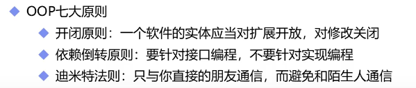
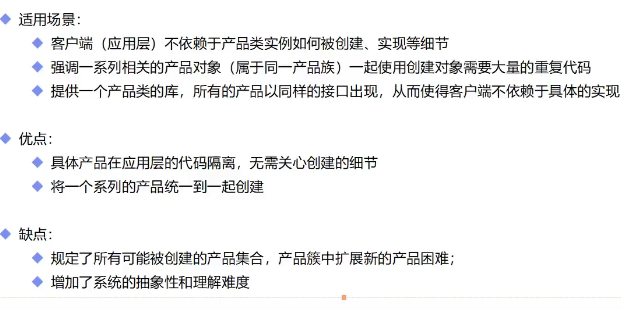
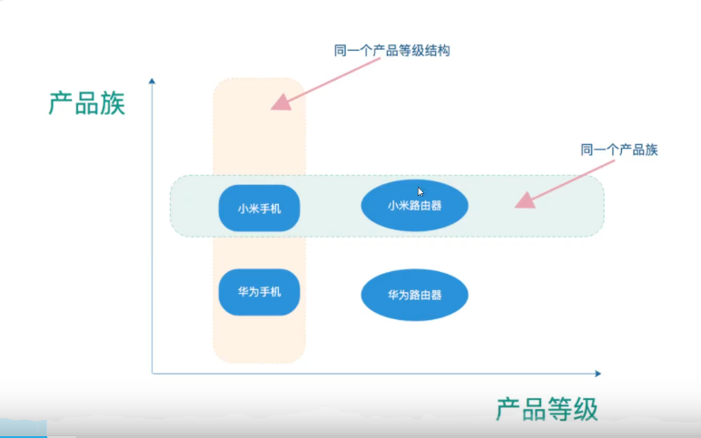
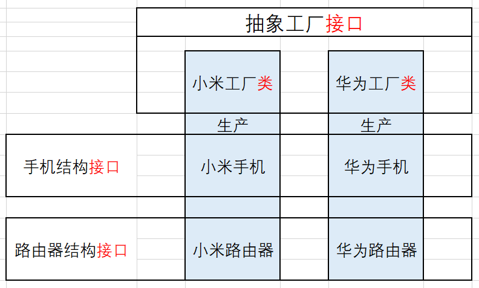

### 核心作用

* #### 实现了创建者和调用者的分离

* 核心本质是实例化对象不使用new，用工厂方法代替

### OOP原则

* 满足以下三个OOP原则



### 实现方式

* 简单工厂模式
* 工厂方法模式
* 抽象工厂模式

#### 简单工厂模式

* 优点：用new来创建，需要了解接口和实现类，但是用工厂模式，就只需要了解工厂方法。而且结构、代码、编程、管理复杂度上都比较简单。
* 缺点：如果有增加新的类型，工厂类就要修改代码，那么就不满足开闭原则，于是就有了工厂方法模式

```java
//接口
public interface Car {
    void name();
}
//实现类1
public class WuLing implements Car{
    @Override
    public void name() {
        System.out.println("五菱");
    }
}
//实现类2
public class Tesla implements Car{
    @Override
    public void name() {
        System.out.println("特斯拉");
    }
}


//简单工厂模式（静态工厂模式）
public class CarFactory {

    public static Car getCar(String car){
        if (car.equals("五菱")){
            return new WuLing();
        }else if(car.equals("特斯拉")){
            return new Tesla();
        }else {
            return null;
        }
    }
    //缺点，如果有增加新的类型，工厂类就要修改代码
    //那么就不满足开闭原则
}

public class Consumer {
    public static void main(String[] args) {

        //原来的方法，使用new来创建对象
        //缺点：要了解接口和所有实现类
        //因此改进成简单工厂模式
        Car car = new WuLing();
        Car car2 = new Tesla();


        //2.修改成工厂创建
        car = CarFactory.getCar("五菱");
        car2 = CarFactory.getCar("特斯拉");
        car.name();
        car2.name();
    }
}

```

#### 工厂方法模式

* 和简单工厂模式的核心区别在于：简单工厂模式只有1个工厂，所有的new都从1个工厂生产；工厂方法模式的核心就在于每个实现类都有一个各自的工厂。

```java
//接口和实现类1、2与简单工厂一样
//增加工厂接口和工厂实现类1、2:
public interface CarFactory {
    Car getCar();
}

//工厂实现类1
public class TeslaFactory implements CarFactory {
    @Override
    public Car getCar() {
        return new Tesla();
    }
}

//工厂实现类2
public class WuLingFactory implements CarFactory {
    @Override
    public Car getCar() {
        return new WuLing();
    }
}
//创建工厂
public class Consumer {
    public static void main(String[] args) {
        //和简单工厂一样，不需要直接new对象，只需要找工厂
        //并且增加其他实现类的时候，不需要修改原来的代码，只需要添加新的类和工厂类，满足了开闭原则
        Car car = new WuLingFactory().getCar();
        Car car2 = new WuLingFactory().getCar();

        car.name();
        car2.name();
    }
}

```


* 优点：和简单工厂一样，不需要直接new对象，只需要找工厂，并且增加其他实现类的时候，不需要修改原来的代码，只需要添加新的类和工厂类
* 缺点：结构、代码、编程、管理复杂度上都比较复杂，因为每个实现类要有对应的工厂实现类，类多了很多，而且代码、管理都要分开处理。
* 实际业务中更多使用的是简单工厂。

#### 抽象工厂模式

* 围绕一个超级工厂创建其他工厂。
* 抽象工厂模式提供了一个创建一系列相关或者相互依赖的接口，无需指定具体的类

##### 使用场景：



##### 产品族和产品等级：

* 所有同一个产品族中的东西，都是同一个产品工厂生产的，但是是不同产品等级结构的。



##### 构建思路

* 所有实现工厂类都在抽象工厂接口下，重写产品（手机和路由器）的生产方法。
* 1个实现工厂只能生产1个产品族的东西。
* 所有相同产品结构的（都是手机）产品在同一接口下，重写该类产品的方法。
* 创建类的时候只需要关心实现工厂类。



##### 示例代码

```java
//抽象产品工厂
public interface IProductFactory {

    //生产手机
    IphoneProduct phoneProduct();

    //生产路由器
    IRouterProduct routerProduct();
}

//手机产品接口
public interface IphoneProduct {

    void start();
    void shutdown();
    void callup();
    void sendSMS();
}

//路由器产品接口
public interface IRouterProduct {

    void start();
    void shutdown();
    void openWifi();
    void setting();
}

//华为手机
public class HuaWeiPhone implements IphoneProduct{
    @Override
    public void start() {
        System.out.println("华为开机");
    }

    @Override
    public void shutdown() {
        System.out.println("华为关机");

    }

    @Override
    public void callup() {
        System.out.println("华为打电话");

    }

    @Override
    public void sendSMS() {
        System.out.println("华为发短信");
    }
}

//华为路由器
package com.rzp.factory.abstractfactory;

public class HuaWeiRouter implements IRouterProduct {
    @Override
    public void start() {
        System.out.println("华为路由器开机");
    }

    @Override
    public void shutdown() {
        System.out.println("华为路由器关机");

    }

    @Override
    public void openWifi() {
        System.out.println("华为路由器开wifi");

    }

    @Override
    public void setting() {
        System.out.println("华为路由器设置");

    }
}

//小米手机和小米路由器类似，不再枚举

//华为工厂,小米工厂类似
public class HuaWeiFactory implements IProductFactory {
    @Override
    public IphoneProduct phoneProduct() {
        return new HuaWeiPhone();
    }

    @Override
    public IRouterProduct routerProduct() {
        return new HuaWeiRouter();
    }
}

```

##### 抽象工厂模式的**主要优点**如下：

- 抽象工厂模式隔离了具体类的生成，使得客户并不需要知道什么被创建。由于这种隔离，更换一个具体工厂就变得相对容易，所有的具体工厂都实现了抽象工厂中定义的那些公共接口，因此只需改变具体工厂的实例，就可以在某种程度上改变整个软件系统的行为。
- 当一个产品族中的多个对象被设计成一起工作时，它能够保证客户端始终只使用同一个产品族中的对象。
- 增加新的产品族很方便，无须修改已有系统，符合"开闭原则"。

抽象工厂模式的**主要缺点**如下：

- 增加新的产品等级结构麻烦，需要对原有系统进行较大的修改，甚至需要修改抽象层代码，这显然会带来较大的不便，违背了"开闭原则"。